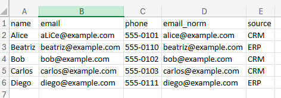
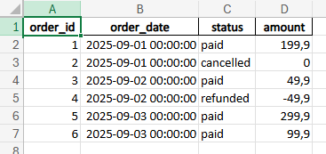
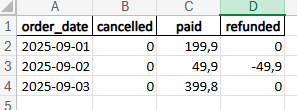

# Data Engineering Portfolio — gghbernardes-coder

Bem-vindo ao meu portfólio de dados
Sou profissional com **6+ anos de experiência em SQL (Oracle, Teradata)**, **ETL (PowerCenter)** e automações de dados.  
Este repositório mostra exemplos práticos de **ETL, SQL e Python** que costumo entregar para clientes em freelas.

---

## 📂 Projetos

### 1. [SQL Sales Analytics](projects/01-sql-sales-analytics)
Consultas SQL para KPIs de vendas (Oracle/Postgres/Teradata) com ranking de produtos e otimizações.

### 2. [ETL Customer Unification](projects/02-etl-customer-unification)
Pipeline em Python (pandas) que unifica bases CRM + ERP, normaliza e-mails e remove duplicidades.
### Exemplo de saída — ETL Customer Unification
Este projeto mostra como unificar cadastros de clientes vindos de **CRM** e **ERP** usando Python.

- **Entrada**:  
  - `data/crm.csv`  
  - `data/erp.csv`  
  (arquivos com nomes, e-mails e telefones de clientes)

- **Processo**:  
  - Normaliza os e-mails (minúsculo + trim).  
  - Marca a origem (CRM ou ERP).  
  - Remove duplicidades priorizando registros do CRM.  
  - Gera uma tabela única e limpa.

- **Saída**:  
  - `outputs/unified_expected.csv` → base de clientes unificada e deduplicada.

#### Exemplo de saída



### 3. [Automation Daily Report](projects/03-automation-daily-report)
Automação de relatório diário gerando Excel com abas de resumo e dados crus.
### Exemplo de relatório diário (Projeto 03)
Este projeto automatiza a geração de relatórios diários em **Excel** a partir de dados de pedidos.

- **Entrada**: `data/orders.csv` (lista de pedidos com data, status e valor).  
- **Processo**: script em Python (`report.py`) que lê os pedidos, cria um **resumo diário por status** (ex.: pagos, cancelados, reembolsados) e salva junto com os dados crus.  
- **Saída**: `outputs/daily_report.xlsx` com duas abas:
  - **Resumo** → consolidação de valores por dia/status.
  - **Raw** → todos os pedidos originais.

#### Exemplo de saída
Camada Raw



Resumo unificado



### 4. [API Enrichment (Geocoding)](projects/04-api-enrichment-geocoding)
Template para enriquecer endereços com latitude/longitude via API (Google ou OpenCage).

### 5. [PowerCenter to Python Migration](projects/05-powercenter-to-python-migration)
Exemplo de migração de regras de transformação do PowerCenter para Python (pandas).

---

## 🚀 Como usar
1. Entre em cada pasta de projeto.  
2. Instale dependências:  
   ```bash
   pip install -r requirements.txt```
3. Rode o script principal (ex.: python etl.py).
4. Resultados ficam em outputs/.

---

## 🎯 Serviços que ofereço
- Limpeza e deduplicação de bases (CSV/Excel/SQL)  
- Queries SQL otimizadas (Oracle, Teradata, Postgres)  
- Pipelines ETL em Python (pandas)  
- Relatórios automatizados em Excel/CSV  

---

## 📩 Contato
- GitHub: [gghbernardes-coder](https://github.com/gghbernardes-coder)  
- LinkedIn: (adicione seu perfil aqui)  
- E-mail: seuemail@exemplo.com
